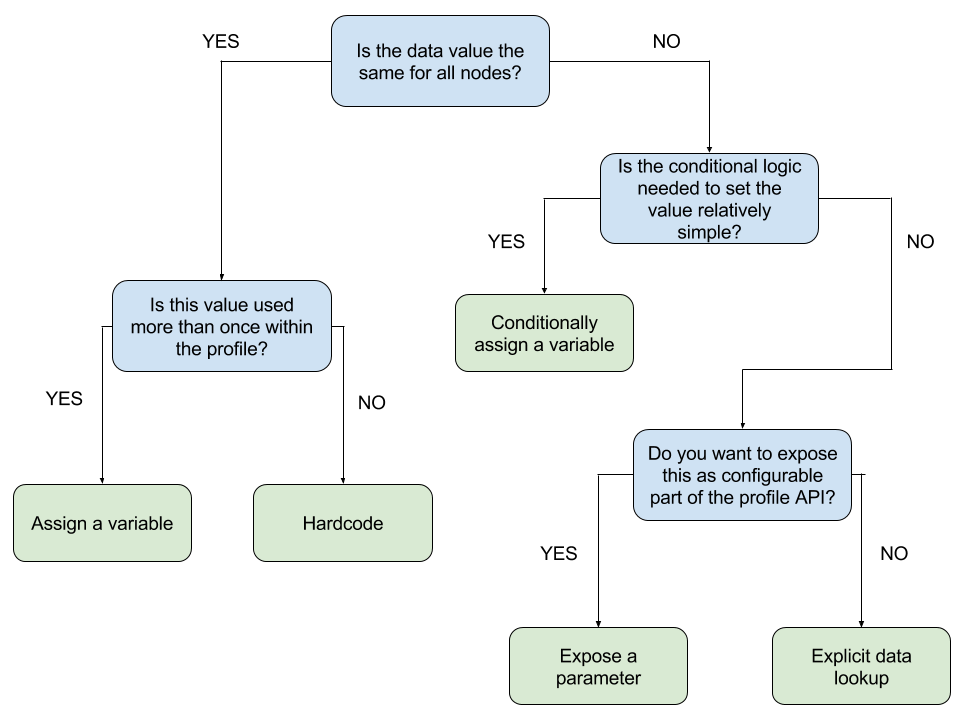

# Data Escalation Path

## Summary

For users of the Roles and Profiles design pattern, site-specific data can be
modeled in many different ways - from hardcoding data within the profile all
the way up to exposing parameters to profiles and performing Hiera lookups.
This standard exists to clarify both the methods available and their utility.

## Expectations

* All Puppet users using the Roles and Profiles design pattern will benefit
  from the guidelines in this standard.

* All guidelines within this standard apply to expressing site-specific data
  within profiles ONLY.

* Instances of "Hiera" may be substituted with the preferred data binding
  backend should Hiera be deemed unsuitable.

## Best Practice Details

### Preferred Option

* Data may be hardcoded within the profile but only if that value occurs once
  and applies to all nodes.

* Variables shall be used for portability when a data value occurs more than
  once.

* Conditional logic may be used to set variables if either the logic is simple,
  the logic is not represented within the configured Hiera hierarchy, or if
  visibility in the DSL is a priority.

* Data shall be stored in Hiera when it becomes necessary to override values in
  a hierarchical manner on a node-specific or business-logic-specific level.

* Explicit Hiera data lookups may be used within the body of a profile ONLY
  if the lookup is private to the implementation.

* A parameter to the profile shall be exposed/created when a data item is
  stored in Hiera and the lookup is part of the profile's API, or if the data
  value is set by an external node classifier (ENC, like the Puppet Enterprise
  Console).

* Parameterized profiles are preferred over explicit Hiera lookups.  Class
  parameters make lookups consistent and present them all in a standardized way.
  Users can quickly determine the data API of a class without having to read or
  understand its logic, and class parameters also expose data lookup information
  about a class that can be useful for potential integration with external
  systems.  Explicit Hiera data lookups (via calls to the lookup() or hiera() functions)
  dilute these benefits.

## Feedback / Ideas for Improvement

* Loosely following RFC2119 for wording of things like 'MUST', 'SHALL', and the
  like: https://www.ietf.org/rfc/rfc2119.txt
* Feedback can be provided as an issue on this [Git
  repository](https://github.com/puppetlabs/best-practices/issues).

## Other Relevant Information

